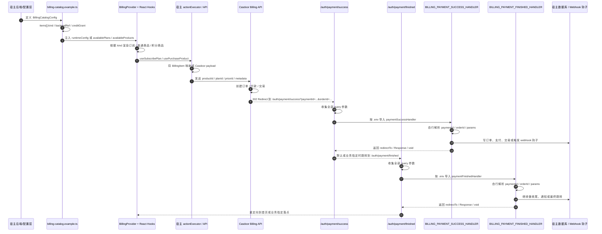

# Billing 到 Casdoor 的对接时序

这份图描述的是：`docs/billing/examples/billing-catalog.example.ts` 里的配置，最后如何通过宿主侧的 `backendRef` 和回跳处理器，和 Casdoor 对接起来。

要点：

- `kind: 'subscription' | 'product'` 是包内 billing 抽象，不是 Casdoor 原生字段
- 真正对接 Casdoor 的是 `backendRef.productId / planId / priceId`
- 支付成功后的 `Success URL` 统一落到宿主的 `/auth/payment/success`
- 购买成功后的 `Return URL` 统一落到宿主的 `/auth/payment/finished`
- `.env` 里的 `BILLING_PAYMENT_SUCCESS_HANDLER` 和 `BILLING_PAYMENT_FINISHED_HANDLER` 决定宿主函数从哪里导入
- 宿主函数自己解析 `paymentId`、`orderId` 和其它 query 参数，再做落库、Webhook 钩子和二次跳转

## 映射说明

示例里的三种 item 只是运行时分类，不直接等于 Casdoor 的原生实体：

- `subscription` 通常映射到 Casdoor 的计划/订阅购买链路
- `product` 通常映射到一次性商品购买链路
- 积分包通常是 `product` 的一种业务语义，购买后额外发放积分

Casdoor 侧实际需要的是：

- `productId`
- `planId`
- `priceId`
- `metadata`

宿主后端负责把 `BillingCatalogConfig` 翻译成 Casdoor 可执行的购买参数，并在成功回跳和完成回调时分别用 `BILLING_PAYMENT_SUCCESS_HANDLER`、`BILLING_PAYMENT_FINISHED_HANDLER` 接管后续业务。
