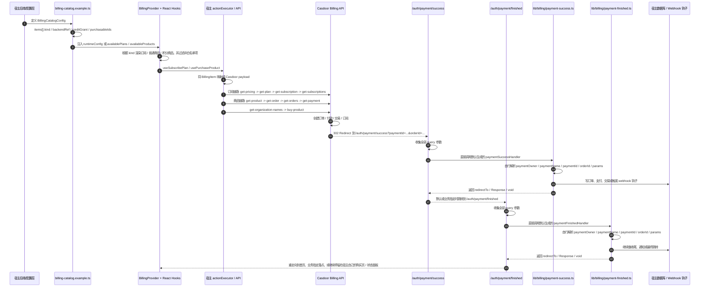

# Billing 到 Casdoor 的对接时序

这份图描述的是：`docs/billing/examples/billing-catalog.example.ts` 里的配置，最后如何通过宿主侧的 `backendRef` 和默认生成的回跳处理器，和 Casdoor 对接起来。

这里要明确区分两条 Casdoor 真相链路：

- `Pricing -> Plan -> Subscription` 是 SaaS 订阅链路，订阅状态、订阅历史和计划价格都应该以 Casdoor 查询结果为准
- `Product -> Order -> Payment` 是一次性商品链路，商品订单列表、订单状态和支付状态都应该以 Casdoor 查询结果为准

要点：

- `kind: 'subscription' | 'product'` 是包内 billing 抽象，不是 Casdoor 原生字段
- `purchasableIds` 是宿主工程的购买白名单，只有白名单里的 item 才能发起 purchase
- 如果宿主已经有自己的会员计划 rows，可以先用 `buildBillingSubscriptionCatalog()` 把它们转成 subscription catalog，再注入 `BillingProvider`
- 真正对接 Casdoor 的是 `backendRef.productId / planId / priceId`
- `fetchPricing` / `pricingLoader`、`fetchPlan` / `planLoader`、`fetchSubscriptionRecord` / `subscriptionRecordLoader`、`fetchSubscriptions` / `subscriptionsLoader` 应该对应 Casdoor 的 `get-pricing`、`get-plan`、`get-subscription`、`get-subscriptions`
- `fetchOrder` / `orderLoader`、`fetchOrders` / `ordersLoader`、`fetchPayment` / `paymentLoader` 应该对应 Casdoor 的 `get-order`、`get-orders`、`get-payment`
- 支付成功后的 `Success URL` 统一落到宿主的 `/auth/payment/success`
- 购买成功后的 `Return URL` 统一落到宿主的 `/auth/payment/finished`
- 购买页、二维码扫描区和支付状态面板都由宿主工程自己渲染，套件只提供 headless hooks 和回调 handler
- 套件默认生成 `lib/billing/payment-success.ts` 和 `lib/billing/payment-finished.ts`
- `app/(auth-kit)/auth-config.ts` 会直接导入这两个默认文件，并把它们暴露为 `paymentSuccessHandler` / `paymentFinishedHandler`
- 宿主函数自己解析 `paymentOwner`、`paymentName`、`paymentId`、`orderId` 和其它 query 参数，再做落库、Webhook 钩子和二次跳转
- 商品购买适配器会先按 `owner/name` 拉取商品详情，再取可用组织名并调用 `buy-product` 兼容接口；宿主只需要配置允许购买的少量 product id
- 订阅 catalog 条目和商品 catalog 条目可以共存于同一个 runtimeConfig，但语义上要继续分开：订阅条目走 pricing / plan / subscription，商品条目走 product / order / payment，宿主 UI 可以并排展示但不要合并为同一个购买对象

## 映射说明

示例里的三种 item 只是运行时分类，不直接等于 Casdoor 的原生实体：

- `subscription` 通常映射到 Casdoor 的计划/订阅购买链路
- `product` 通常映射到一次性商品购买链路
- 积分包通常是 `product` 的一种业务语义，购买后额外发放积分
- 宿主工程只暴露 `purchasableIds` 指定的那几个 item，购买时不会把整套 Casdoor 商品都开放出来

Casdoor 侧实际需要的是：

- `productId`
- `planId`
- `priceId`
- `metadata`

宿主后端负责把 `BillingCatalogConfig` 翻译成 Casdoor 可执行的购买参数，并在成功回跳和完成回调时分别通过默认生成的 `lib/billing/payment-success.ts`、`lib/billing/payment-finished.ts` 接管后续业务。
