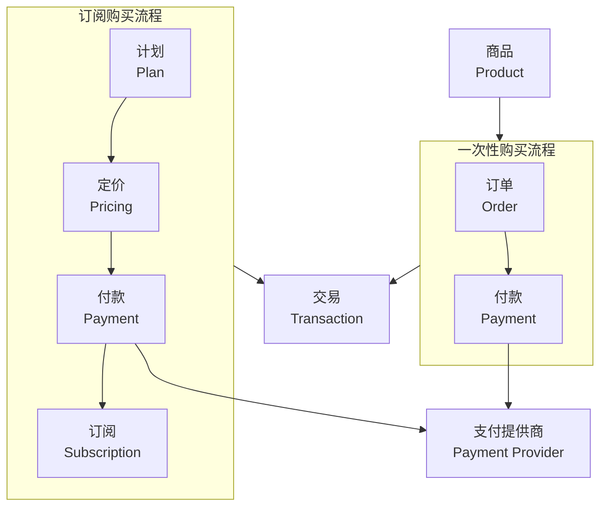

各个概念关系

*   **商品是货架上的物品；付款是结账动作；订单是完成后的购物凭证；计划是订阅的具体套餐；定价是把多个套餐组合成选项供用户选择；订阅是用户付款后获得的持续权限；交易是最终的账本记录。**

为了更清晰地理解它们之间的关系，可以参考这张流程图：



下面是对每个概念的详细解释：

---

### 🛒 商品 (Product)
*   **定义**：**商品**是你准备在 Casdoor 上销售的具体产品或服务。
*   **核心价值**：商品是销售的基础单元。你可以为它设定价格、支持的支付方式等属性，并决定是用于一次性销售还是基于订阅的服务。

### 💳 付款 (Payment)
*   **定义**：**付款**是通过已集成的支付网关处理实际财务交易的记录。
*   **核心价值**：它记录了一次支付尝试或成功的交易，并负责与支付宝、微信等第三方提供商对接。对于支付宝或微信支付等外部提供商，Casdoor 只有在收到成功支付通知后才会创建对应的`付款`记录。

### 📦 订单 (Order)
*   **定义**：**订单**是用户在购买商品时创建的记录，用于追踪和管理一次购买行为的具体内容和状态。
*   **核心价值**：订单记录了用户“买了什么”以及商品交付的详细信息。它内部可以包含一个或多个商品，并记录了购买时的价格快照。

### 🧭 可购买项白名单
*   **定义**：宿主工程在一个更大的 Casdoor 商品集合里，只挑选少量允许购买的 item key / productId / planId。
*   **核心价值**：Casdoor 可以继续维护很多产品，但单个项目只暴露自己允许买的那几个条目。`BillingProvider` 会用这个白名单过滤可购买列表，并在发起 purchase 时拒绝未配置项。

### 📝 计划 (Plan)
*   **定义**：**计划**定义了一个订阅服务的具体内容、功能和价格。
*   **核心价值**：计划是构成订阅服务的基础模块。它与特定的用户角色和产品关联，是订阅的核心内容载体。

### 💲 定价 (Pricing)
*   **定义**：**定价**是将一个或多个**计划**组合在一起的结构，让用户能在不同的价格点选择套餐。
*   **核心价值**：它像一个套餐组合包，为用户提供了不同级别的订阅选择，例如“基础版”、“专业版”、“企业版”套餐。

### 🔁 订阅 (Subscription)
*   **定义**：**订阅**用于管理用户选择的计划和对应的应用访问权限。
*   **核心价值**：订阅的流程通常是：**定价 → 计划 → 付款 → 订阅**。它管理着周期性权限的授予、续费、取消等整个生命周期。

### 📒 交易 (Transaction)
*   **定义**：**交易**记录用户的财务活动，如购买、充值、账户余额变动等。
*   **核心价值**：它像一个总账本，是所有收入、支出和余额变更的完整记录。每次成功扣款或充值，都会生成一笔`交易`记录。


在 Casdoor 的商品配置里，“成功URL”和“返回URL”听起来相似，但它们的角色和用途完全不同，一个是服务端与平台通信用的 **`异步通知`** (Webhook)，另一个则是给用户浏览器跳转用的 **`同步通知`** (Redirect)。

**成功URL (Success URL)**
* **作用**：**同步回跳**。支付成功后，Casdoor 会把用户浏览器重定向回这个地址，并携带支付参数，**依赖用户浏览器发起 GET 请求**。
* **如何使用**：通常用于站内的支付成功接收壳，例如 `https://your-website.com/auth/payment/success?paymentId=payment_xxx&orderId=order_yyy`。
* **值得关注**：它适合做前台结果承接、订单补全、支付确认和 webhook 钩子触发；真正的业务收尾逻辑应该放到宿主自己的默认处理器里。

**返回URL (Return URL)**
* **作用**：**同步回调**。支付流程结束后，支付平台会把用户浏览器**重定向**回你指定的这个固定路径，并携带支付参数。
* **如何使用**：建议把它配置成站内的最终回调壳，例如 `https://your-website.com/auth/payment/finished?paymentId=payment_xxx&orderId=order_yyy`。
* **值得关注**：这个路径本身不是页面，而是给宿主自己做最终跳转、补偿任务和结束态处理的入口。

### ⚠️ 重要提醒

*   **两者相辅相成，缺一不可**：`成功URL` 用于**后台确认**以确保订单状态同步，`返回URL` 用于**前台收尾**以改善用户体验，建议**都进行配置**。
*   **已知问题**：根据 [微信开放社区] 的反馈，Casdoor 在集成微信支付时，`成功URL` 可能会遇到参数丢失导致验证失败的问题。如果出现此问题，通常需要手动调用通知接口来确认支付。相比之下，支付宝的集成则更加稳定。
*   **调试小妙招**：先试“模拟支付”（例如Casdoor自带的Dummy provider），这可以帮助你快速验证两个URL是否配置正确。

📝 “成功URL”会携带哪些参数
Casdoor 的“成功URL”是以 HTTP 302 重定向 的方式被触发的，携带的参数会以 GET 请求（即直接体现在网址中） 的形式传递。

支付成功后携带的参数
参数名	说明	示例值
paymentId	支付记录的ID	payment_b52d...
orderId	关联的订单ID	order_abc1...
当用户支付成功后，浏览器会被重定向到类似这样的URL：
https://your-website.com/auth/payment/success?paymentId=payment_xxx&orderId=order_yyy

### 通用 Success URL 接入

本仓库把这个落点统一收敛到宿主站内的 `/auth/payment/success`，路由壳会把请求参数交给宿主自己实现的处理器，再由处理器决定是否跳转到 `/auth/payment/finished`。

如果商品在 Casdoor 里显式配置了 Success URL，支付成功后 Casdoor 会把浏览器先带到这里，再由宿主处理器按需调用 `NotifyPayment` 完成支付确认。

套件会默认生成宿主侧处理器文件 `lib/billing/payment-success.ts`，`app/(auth-kit)/auth-config.ts` 会直接导入它并导出为 `paymentSuccessHandler`。默认处理器的签名如下：

```ts
export async function paymentSuccessHandler(input: {
  paymentId: string | null;
  orderId: string | null;
  paymentOwner: string | null;
  paymentName: string | null;
  redirectTo: string | null;
  status: 'success' | 'failure';
  params: Record<string, string>;
  searchParams: URLSearchParams;
  request: Request;
}): Promise<Response | string | { redirectTo?: string | null } | void>
```

路由壳会把所有 query 参数原样放进 `params`，其中 `paymentOwner`、`paymentName`、`paymentId` 和 `orderId` 会单独透出，宿主函数可以自行完成参数解析、落库、Webhook 钩子和后续跳转。

### 通用 Finished URL 接入

本仓库把这个固定回调路径统一收敛到宿主站内的 `/auth/payment/finished`，路由壳会把请求参数交给宿主自己实现的处理器，再由处理器决定最终跳转。

套件会默认生成宿主侧处理器文件 `lib/billing/payment-finished.ts`，`app/(auth-kit)/auth-config.ts` 会直接导入它并导出为 `paymentFinishedHandler`。签名与 success 处理器一致。

如果默认处理器没有写入业务逻辑，路由会打印日志并回落到首页 `/`。

### purchase-first 的宿主编排

对单个项目来说，推荐把购买动作拆成这三步：

1. 宿主工程通过 `BillingProvider` 或后端配置注入 `BillingCatalogConfig`
2. `BillingCatalogConfig.purchasableIds` 只保留当前项目允许购买的条目
3. 用户发起 `purchase` 后，包内购买适配器先按商品 ID 拉取 Casdoor 商品详情，再选择 provider 并发起 Casdoor 下单；这里的 loader 约定返回 Casdoor 标准响应 envelope，真正的数据放在 `data` 里。`productId` 推荐写成 `owner/name` 形式，例如 `qixiaoju/创小剧积分包-50`，并且要和 `GET /api/get-product?id=qixiaoju/创小剧积分包-50` 保持一致；`buy-product` 返回 `status: "error"` 时，`msg` 里的错误信息会直接透传给宿主的 `onPurchaseError` / `onPurchaseComplete`；回跳后由 `payment-success.ts` 和 `payment-finished.ts` 做宿主侧收尾

商品详情页如果要展示支持的支付方式，可以直接调用 `useBillingProductDetail(productId)`，拿到 `providers` 和 `providerObjs` 后按 provider 渲染不同的购买按钮和参数。

宿主如果在 UI 上选中了某个支付方式，可以把 provider 名称直接传给 `purchaseProduct.run({ key, providerName })`，这样后续 Casdoor 下单会稳定使用这个 provider，而不会再靠内部自动挑选。

如果宿主想减少页面里的样板代码，也可以直接用 `useBillingProductPurchaseOptions(productId)`，它会把商品详情、`providers`、`providerObjs`、当前 `providerName` 和 `setProviderName` 一起返回。

这个 hook 只是给单选场景提供默认态；如果宿主想同时渲染两个不同的支付入口，直接遍历 `providerObjs` 就行，`selectedProvider` 只是一个方便的当前选中项引用，不会限制宿主的 UI 结构。

如果宿主还需要订单系统、积分发放、会员升级或 webhook，建议都放在默认生成的 `lib/billing/payment-success.ts` / `lib/billing/payment-finished.ts` 里，不要改回路由壳里硬编码。

billing 的页面层完全由宿主工程自己控制。套件不生成 product page、buy page、二维码扫描页或 payment result page，只提供 headless hooks、Casdoor 购买适配器、支付回调 handler 和纯数据模型。宿主如果要展示二维码、支付状态或订单详情，可以在自己的页面里直接读取 `BillingCasdoorPaymentResponse`、`BillingCasdoorAccountResponse`、`BillingCasdoorApplicationResponse`，或者调用对应 loader。

同一套 loader 约定也适用于 `fetchAccount`、`fetchApplication` 和 `fetchPayment`：宿主同域代理时请求 `/auth/api/get-account`、`/auth/api/get-application`、`/auth/api/get-payment`，直连 Casdoor origin 时则分别请求 `/api/get-account`、`/api/get-application`、`/api/get-payment`。

同域代理请求 Casdoor 时，支付结果轮询应该走 `/auth/api/get-payment?id=...`；如果宿主直接在浏览器里请求 `NEXT_PUBLIC_CASDOOR_SERVER_URL` 对应的 Casdoor origin，则路径是 `/api/get-payment?id=...`。两种场景都使用同一套 response envelope，真正的数据都放在 `data` 里。

💡 已知问题提醒
